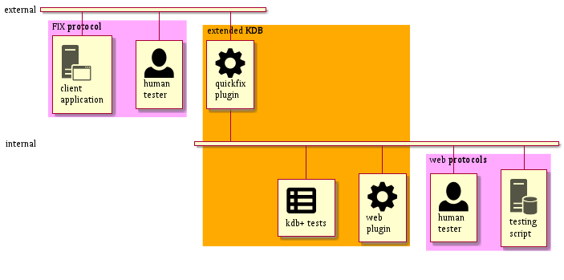

# kdb-quickfix-plugin
Plugin to test FIX applications from kdb+

# External dependencies 
This project depends on several libraries and frameworks, among them:

- [Openssl](https://www.openssl.org)
- [Asio](https://think-async.com/Asio)
- [CppServer](https://github.com/chronoxor/CppServer)
- [Quickfix](https://github.com/quickfix/quickfix) 
- [Quickfix-messenger](https://github.com/jramoyo/quickfix-messenger)
